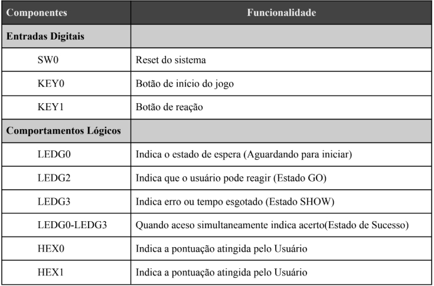
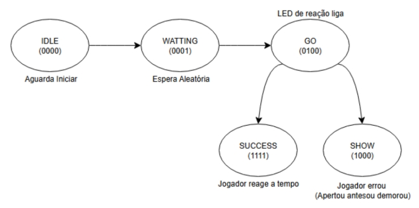

# JogoTesteDeReflexo
O projeto foi desenvolvido por Ariadne Silva, Arthur Queiroz e César Miranda

# Jogo Teste de Reflexo
O projeto visa desenvolver em um sistema digital embarcado um jogo chamado Jogo de Reflexo, com objetivo de testar a resposta de um usuário diante de um estímulo visual, aliada a recursos de temporização para controlar as etapas do teste: espera aleatória, sinal de resposta, detecção de tempo de reação e exibição dos resultados. O sistema é desenvolvido em linguagem VHDL e implementado na plataforma DE2(Cyclone II). Sua aplicação é utilizada em áreas de psicologia experimental, testes psicotécnicos, treinamento esportivo e reabilitação motora, oferecendo também uma base didática para ensino de lógica digital.

   

## 1. INTRODUÇÃO 

Neste relatório, iremos detalhar os requisitos técnicos, a escolha dos componentes, a estrutura de funcionamento e os resultados obtidos com a simulação do sistema. O projeto tem como foco o desenvolvimento de um Jogo de Reflexo, implementado em linguagem VHDL e executado na plataforma DE2 (FPGA Cyclone II), que visa testar a reação de um usuário diante de um estímulo visual. 

Esse tipo de aplicação é relevante em contextos como treinamentos cognitivos, testes psicotécnicos, exercícios de coordenação motora e ambientes educacionais, além de proporcionar uma oportunidade prática para consolidar conhecimentos em sistemas digitais embarcados. A implementação utiliza recursos fundamentais da placa DE2, incluindo botões (KEYs), switches (SWs), LEDs e displays de 7 segmentos. O controle do sistema é realizado por meio de uma FSM com cinco estados principais (IDLE, WAITING, GO, SUCCESS e SHOW), onde o tempo de espera e a janela de reação são controlados por contadores baseados no clock de 45 MHz da placa. Um gerador de número pseudo aleatório (baseado em LFSR) é utilizado para variar dinamicamente o tempo de espera, proporcionando imprevisibilidade ao teste de reflexo. As interações com o usuário ocorrem por meio de botões de start, resposta e reset, enquanto os LEDs indicam o estado atual do jogo. Os resultados são apresentados nos displays e por meio de sinais visuais, promovendo uma experiência interativa e didática. 

Serão detalhados os requisitos técnicos, a arquitetura do sistema, o funcionamento da lógica de controle, a montagem na placa e os testes realizados por simulação e validação prática. A escolha deste projeto se justifica pela capacidade de integrar múltiplos componentes da FPGA de forma coesa, evidenciando sua aplicabilidade tanto acadêmica quanto funcional. 

## 2. DESENVOLVIMENTO 

Apresentaremos os principais elementos envolvidos no desenvolvimento do projeto Jogo de Reflexo. Isso inclui os requisitos técnicos, a montagem na plataforma DE2, a lógica de funcionamento representada por um fluxograma, além da codificação realizada em linguagem VHDL. 

### 2.1 Requisitos Técnicos 
O projeto foi desenvolvido de acordo com os requisitos estabelecidos pela disciplina de Sistemas Embarcados, sendo todos eles devidamente atendidos e usando em uma FPGA Cyclone II EP2C35F672C6 como hardware principal. Abaixo estão os itens obrigatórios e como eles foram implementados.

### Tabela 01 – Itens de Entradas Digitais e Comportamentos Lógicos

   

<em>Fonte: Elaborada pelos autores.</em>

Foram utilizados 2 displays de 7 segmentos para realizar a contagem de acertos, também implementamos uma lógica com máquinas de estados finita(FSM), com cinco estados: IDLE, WATITING, GO, SUCESS e SHOW. 

### Figura 01 - Ilustração do funcionamento da Máquina de Estados Finitos

   

<em>Fonte: Elaborada pelos autores.</em>

A simulação foi realizada no Quartus para verificação das transições dos estados. Além disso, foram coletados requisitos mínimos para criação desse projeto, após a execução do VHDL.

