# JogoTesteDeReflexo
O projeto foi desenvolvido por Ariadne Silva, Arthur Queiroz e César Miranda

# Jogo Teste de Reflexo
O projeto visa desenvolver em um sistema digital embarcado um jogo chamado Jogo de Reflexo, com objetivo de testar a resposta de um usuário diante de um estímulo visual, aliada a recursos de temporização para controlar as etapas do teste: espera aleatória, sinal de resposta, detecção de tempo de reação e exibição dos resultados. O sistema é desenvolvido em linguagem VHDL e implementado na plataforma DE2(Cyclone II). Sua aplicação é utilizada em áreas de psicologia experimental, testes psicotécnicos, treinamento esportivo e reabilitação motora, oferecendo também uma base didática para ensino de lógica digital.

<p align="center">
  <br>
</p>

## 1. INTRODUÇÃO 

Neste relatório, iremos detalhar os requisitos técnicos, a escolha dos componentes, a estrutura de funcionamento e os resultados obtidos com a simulação do sistema. O projeto tem como foco o desenvolvimento de um Jogo de Reflexo, implementado em linguagem VHDL e executado na plataforma DE2 (FPGA Cyclone II), que visa testar a reação de um usuário diante de um estímulo visual. 

Esse tipo de aplicação é relevante em contextos como treinamentos cognitivos, testes psicotécnicos, exercícios de coordenação motora e ambientes educacionais, além de proporcionar uma oportunidade prática para consolidar conhecimentos em sistemas digitais embarcados. A implementação utiliza recursos fundamentais da placa DE2, incluindo botões (KEYs), switches (SWs), LEDs e displays de 7 segmentos. O controle do sistema é realizado por meio de uma FSM com cinco estados principais (IDLE, WAITING, GO, SUCCESS e SHOW), onde o tempo de espera e a janela de reação são controlados por contadores baseados no clock de 45 MHz da placa. Um gerador de número pseudo aleatório (baseado em LFSR) é utilizado para variar dinamicamente o tempo de espera, proporcionando imprevisibilidade ao teste de reflexo. As interações com o usuário ocorrem por meio de botões de start, resposta e reset, enquanto os LEDs indicam o estado atual do jogo. Os resultados são apresentados nos displays e por meio de sinais visuais, promovendo uma experiência interativa e didática. 

Serão detalhados os requisitos técnicos, a arquitetura do sistema, o funcionamento da lógica de controle, a montagem na placa e os testes realizados por simulação e validação prática. A escolha deste projeto se justifica pela capacidade de integrar múltiplos componentes da FPGA de forma coesa, evidenciando sua aplicabilidade tanto acadêmica quanto funcional. 

## 2. DESENVOLVIMENTO 

Apresentaremos os principais elementos envolvidos no desenvolvimento do projeto Jogo de Reflexo. Isso inclui os requisitos técnicos, a montagem na plataforma DE2, a lógica de funcionamento representada por um fluxograma, além da codificação realizada em linguagem VHDL. 

### 2.1 Requisitos Técnicos 
O projeto foi desenvolvido de acordo com os requisitos estabelecidos pela disciplina de Sistemas Embarcados, sendo todos eles devidamente atendidos e usando em uma FPGA Cyclone II EP2C35F672C6 como hardware principal. Abaixo estão os itens obrigatórios e como eles foram implementados.

<p align="center">Tabela 01 – Itens de Entradas Digitais e Comportamentos Lógicos
</p>

<p align="center">
  <br>
</p>
<p align="center"><em>Fonte: Elaborada pelos autores.</em></p>

Foram utilizados 2 displays de 7 segmentos para realizar a contagem de acertos, também implementamos uma lógica com máquinas de estados finita(FSM), com cinco estados: IDLE, WATITING, GO, SUCESS e SHOW. 

<p align="center">Figura 01 - Ilustração do funcionamento da Máquina de Estados Finitos
</p>
  
<p align="center">
  <br>
</p>
<p align="center"><em>Fonte: Elaborada pelos autores.</em></p>

A simulação foi realizada no Quartus para verificação das transições dos estados. Além disso, foram coletados requisitos mínimos para criação desse projeto, após a execução do VHDL.

<p align="center">Figura 02 - Elementos Lógicos e Flip Flops
</p>

<p align="center">
  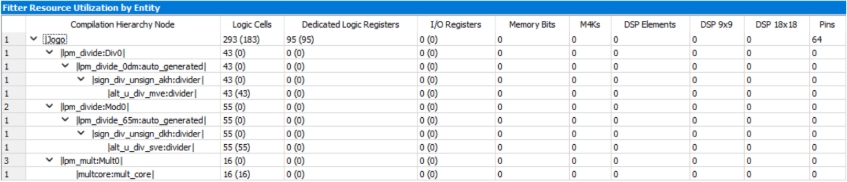<br>
</p>
<p align="center"><em>Fonte: Produzido no Quartus II.</em></p>

A síntese e o mapeamento do projeto no software Quartus resultaram no uso dos seguintes recursos de hardware do FPGA:

● Células Lógicas (Logic Cells): 
O projeto utilizou um total de 293 célulaslógicas. Essas células lógicas são os blocos fundamentais do FPGA usados para implementar funções lógicas combinacionais (como as portas AND, OR, XOR) e sequenciais (registradores).

● Registradores (Dedicated Logic Registers): 
Foram utilizados 95 registradores dedicados. Estes são os Flip-Flops (FFs) que armazenam os estados do sistema, como o estado atual da máquina de estados (state), os contadores (wait_count, score_count) e o valor do gerador pseudo aleatório (lfsr_counter).

<p align="center">Figura 03 - Recursos Utilizados
</p>

<p align="center">
  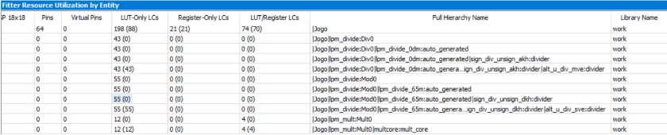<br>
</p>
<p align="center"><em>Fonte: Produzido no Quartus II.</em></p>

● Pinos de I/O (Pins): 
O projeto utilizou 64 pinos de entrada e saída paraconectar os componentes externos, como o clock, botões de reset/start/react e para controlar os 8 displays de 7 segmentos e os 4 LEDs. Além disso, uma análise detalhada da hierarquia de recursos mostrou que o sintetizador do Quartus inferiu automaticamente megafunções otimizadas (LPM - Library of Parameterized Modules) para as operações aritméticas presentes no código VHDL: 

● Módulo de Divisão (lpm_divide:Div0): 
Foi inferido para realizar a operação de divisão inteira (score_count / 10), necessária para obter o dígito das dezenas do placar. Este módulo consumiu 43 células lógicas.

● Módulo de Módulo (lpm_divide:Mod0): Foi inferido para a operação de módulo (score_count mod 10), usada para obter o dígito das unidades do placar. Esta operação é mais complexa que a divisão em hardware, o que se reflete no consumo de 55 células lógicas.

● Módulo de Multiplicação (lpm_mult:Mult0): Foi inferido para a operação de multiplicação (random_base * RANDOM_STEP_CYCLES), que calcula o tempo de espera aleatório. Este módulo foi otimizado para consumir apenas 16 células lógicas. 

Subtraindo os recursos consumidos pelos módulos aritméticos inferidos, conclui-se que a lógica principal do projeto (a máquina de estados, o gerador LFSR e os decodificadores para os displays) consome aproximadamente 179 células lógicas e a totalidade dos 95 registradores. Isso demonstra que as operações de divisão e módulo, apesar de simples em software, representam uma parte significativa (~39%) do consumo de lógica combinacional do projeto quando implementadas em hardware.

**Cálculo:**

● Total de Células Lógicas: 293

● Lógica dos Módulos Inferidos: 43 (Div) + 55 (Mod) + 16 (Mult) = 114

● Lógica Principal do Jogo: 293 - 114 = 179 células lógicas.

<p align="center">Figura 04 - Clocks
</p>

<p align="center">
  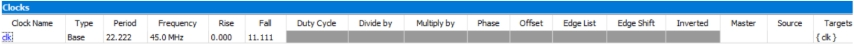<br>
</p>
<p align="center"><em>Fonte: Produzido no Quartus II.</em></p>

Para realizar uma análise de tempo (timing analysis) precisa, foi criada uma restrição de design (através de um arquivo SDC) para informar ao software a frequência de operação do sistema. A primeira tabela demonstra essa configuração:

● Foi definido um clock base chamado clk com uma frequência alvo de 45.0 MHz, correspondente ao clock de entrada da placa FPGA.

● Isso estabelece um requisito de tempo: todos os caminhos lógicos síncronos com este clock devem ter um atraso total inferior ao seu período, que é de 22.222 ns.

<p align="center">Figura 04 - Clocks
</p>

<p align="center">
  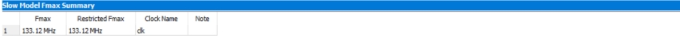<br>
</p>
<p align="center"><em>Fonte: Produzido no Quartus II.</em></p>


A tabela 'Slow Model Fmax Summary' apresenta a frequência máxima de operação (f_max) calculada para o projeto. O resultado foi obtido sob o 'Slow Model', que simula as piores condições de operação (tensão mais baixa e temperatura mais alta), garantindo a robustez do projeto.

● A f_max calculada para o domínio de clock clk foi de 133.12 MHz.

A análise de tempo do projeto resultou em uma frequência máxima de operação (f_max) de 133.12 MHz. Comparando este resultado com a frequência alvo do sistema, que é de 45 MHz, conclui-se que o projeto atende e excede os requisitos de tempo com uma margem de segurança considerável.

A f_max obtida é aproximadamente 2.95 vezes superior à frequência necessária (133.12 / 45). Isso indica que não existem caminhos de dados críticos que limitem o desempenho do circuito e que o design é robusto do ponto de vista de tempo, operando de forma confiável na frequência desejada sem violações de timing (setup time).

<p align="center">Figura 06 - Latência
</p>

<p align="center">
  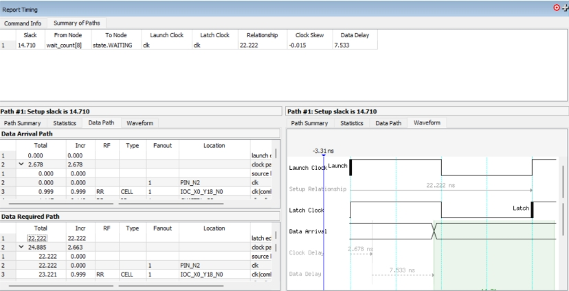<br>
</p>
<p align="center"><em>Fonte: Produzido no Quartus II.</em></p>

A imagem acima apresenta um relatório detalhado de tempo (Report Timing) para um caminho crítico específico no design. O caminho analisado origina-se no oitavo bit do registrador do contador de espera (wait_count[8]) e termina no registrador da máquina de estados (state.WAITING).

Este caminho é fundamental para a lógica do jogo, pois faz parte do circuito que compara o valor do contador com o tempo de espera alvo para decidir se deve ou não transitar para o próximo estado.

Segundo a imagem:
● **Data Delay:** 7.533 ns
● **Relationship (Período do Clock):** 22.222 ns
● **Setup Slack:** 14.710 ns

A análise deste caminho revela os seguintes parâmetros de tempo:

● **Latência de Propagação (Data Delay):** O valor de 7.533 ns representa a latência de propagação do sinal neste caminho. Este é o tempo real que o sinal levou para viajar desde a saída do flip-flop de origem (wait_count[8]), passar pela lógica combinacional
e chegar até a entrada do flip-flop de destino (state.WAITING).

● **Orçamento de Tempo (Clock Relationship):** O valor de 22.222 ns é o período do clock de 45 MHz. Ele representa o "orçamento" de tempo máximo que o sinal tem para completar sua jornada entre dois pulsos de clock consecutivos.

● **Folga de Tempo (Setup Slack):** O valor do "Setup Slack" foi de +14.710 ns. O slack é a diferença entre o tempo que o sinal precisava para chegar (o "orçamento") e o tempo que ele realmente levou. Um valor positivo é excelente e significa que o requisito de tempo foi atendido com uma grande margem de segurança. O sinal chegou ao seu destino 14.710 ns antes do prazo final.

Em conclusão, a análise de tempo detalhada para um caminho crítico representativo do projeto demonstra uma latência de propagação interna de 7.533 ns. Como este valor é significativamente inferior ao período do clock (22.222 ns), o design opera de forma robusta e livre de erros de tempo. A folga de tempo (slack) positiva de 14.710 ns confirma que o circuito atende às especificações com uma excelente margem de segurança, o que corrobora a alta frequência máxima (f_max) de 133.12 MHz calculada anteriormente. Isso garante que, na frequência de operação de 45 MHz, o sistema é estável e confiável.

### 2.2 Montagem do circuito
A montagem do circuito foi realizada utilizando os recursos disponíveis na placa DE2, utilizando os seguintes pinos e recursos:

<p align="center">Tabela 02 - Lista de pinos utilizados
</p>

<p align="center">
  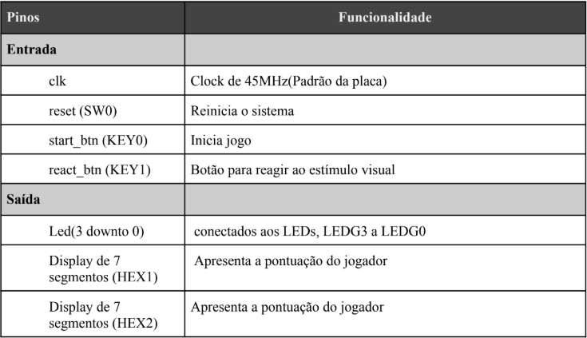<br>
</p>
<p align="center"><em>Fonte: Produzido no Quartus II.</em></p>

A configuração dos pinos foi realizada no arquivo de pinagem (.qsf) no Quartus, associando os sinais VHDL aos elementos da placa FPGA.

### 2.3 Funcionamento do circuito

Para compreender de forma clara a lógica sequencial que rege o comportamento do sistema, apresenta-se na Figura 01 o fluxograma do processo de funcionamento do circuito. Esse fluxograma demonstra como se dá o processo de funcionamento do circuito, estados do sistema e as transições entre eles, desde a inicialização até a exibição do resultado final.

<p align="center">Figura 07 - Fluxograma do processo de funcionamento
</p>

<p align="center">
  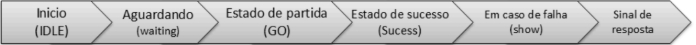<br>
</p>
<p align="center"><em>Fonte: Elaborado pelos Autores.</em></p>

1. Início (IDLE): Estado inicial do sistema, todos os leds estão desligados, aguardando o acionamento do botão (KEY0) para iniciar o jogo.

2. Aguardando (WAITING): Após o sistema reconhecer o toque do botão de início, começa o estado de espera. Nele o jogador vai esperar um tempo aleatório (entre 2 a 7 segundos) para o LEDG0 aceso, se o botão (KEY1) for pressionado antes do tempo , é considerado erro e vai para o estado SHOW. Caso o tempo expire,transita para o estado GO

3. No estado de partida (GO): LEDG2 acenderá. O usuário deve pressionar o botão (KEY1) dentro de 1 segundo, se pressionar dentro do tempo vai para o estado de SUCCESS, se o tempo esgotar sem resposta vai para o estado SHOW(erro).

4. O estado de sucesso (SUCCESS): Quando todos os LEDs ficarem acesos,
indica acerto. E aguarda o botão de reação ser solto para reiniciar a próxima
rodada com novo tempo aleatório.

5. Em caso de falha (SHOW): O LEDG3, acenderá indicando erro, reação que ocorre caso pressione antes do esperado ou tenha o tempo esgotado. E também aguarda o acionamento do botão de start para voltar ao estado IDLE (Início).

6. Sinal de Resposta (Display): A cada acerto realizado a pontuação aparecerá no display de sete segmentos (HEX0 e HEX1)

### 2.4 Codificação utilizando a linguagem de programação VHDL

Abaixo, mostraremos como o código-fonte foi desenvolvido em linguagem VHDL, estruturado para ser executado diretamente em uma FPGA.

### Código-fonte em linguagem VHDL

```vhdl
 001: BIBLIOTECAS USADAS -----------------------------------------------------------------------------
 002: Esta seção importa as bibliotecas necessárias para o projeto.
 003: library IEEE;
 004: use IEEE.STD_LOGIC_1164.ALL;
 005: use IEEE.STD_LOGIC_ARITH.ALL;
 006: use IEEE.STD_LOGIC_UNSIGNED.ALL;
 007: ---------------------------------------------------------------------------------------------------
 008: ENTIDADE ---------------------------------------------------------------------------------------
 009: A entidade "Jogo" define a interface do nosso circuito, ou seja, suas portas de entrada e saída.
 010: entity Jogo is
 011: Port (
 012: -- ENTRADAS
 013: clk : in STD_LOGIC;
 014: reset : in STD_LOGIC;
 015: start_btn : in STD_LOGIC;
 016: react_btn : in STD_LOGIC;
 017: -- SAÍDAS
 018: leds : out STD_LOGIC_VECTOR(3 downto 0);
 019: HEX0 : out STD_LOGIC_VECTOR(6 downto 0);
 020: HEX1 : out STD_LOGIC_VECTOR(6 downto 0);
 021: HEX2 : out STD_LOGIC_VECTOR(6 downto 0);
 022: HEX3 : out STD_LOGIC_VECTOR(6 downto 0);
 023: HEX4 : out STD_LOGIC_VECTOR(6 downto 0);
 024: HEX5 : out STD_LOGIC_VECTOR(6 downto 0);
 025: HEX6 : out STD_LOGIC_VECTOR(6 downto 0);
 026: HEX7 : out STD_LOGIC_VECTOR(6 downto 0)
 027: );
 028: end Jogo;
 029: ---------------------------------------------------------------------------------------------------
 030: ARQUITETURA ------------------------------------------------------------------------------------
 031: architecture Behavioral of Jogo is
 032: -- CONSTANTES DE TEMPO E FREQUÊNCIA
 033: constant CLK_FREQ_HZ : integer := 45_000_000;
 034: constant MIN_WAIT_S : real := 2.0;
 035: constant MAX_WAIT_S : real := 7.0;
 036: constant REACTION_WINDOW_S : real := 1.0;
 037: -- CONVERSÃO DE TEMPO PARA CICLOS DE CLOCK
 038: constant MAX_WAIT_CYCLES : integer := integer(MAX_WAIT_S * real(CLK_FREQ_HZ));
 039: constant MIN_WAIT_CYCLES : integer := integer(MIN_WAIT_S * real(CLK_FREQ_HZ));
 040: constant WAIT_RANGE_CYCLES : integer := integer((MAX_WAIT_S - MIN_WAIT_S) * real(CLK_FREQ_HZ));
 041: constant REACTION_WINDOW_CYCLES : integer := integer(REACTION_WINDOW_S * real(CLK_FREQ_HZ));
 042: constant RANDOM_STEP_CYCLES : integer := WAIT_RANGE_CYCLES / 15;
 043: -- MÁQUINA DE ESTADOS
 044: type state_type is (IDLE, WAITING, GO, SUCCESS, SHOW);
 045: signal state : state_type := IDLE;
 046: -- SINAIS INTERNOS
 047: signal wait_count : integer range 0 to MAX_WAIT_CYCLES := 0;
 048: signal random_target : integer range 0 to MAX_WAIT_CYCLES := 0;
 049: signal lfsr_counter : STD_LOGIC_VECTOR(25 downto 0) := (others => '0');
 050: signal start_btn_prev : STD_LOGIC := '1';
 051: -- SINAIS PARA O PLACAR
 052: signal score_count : integer range 0 to 99 := 0;
 053: signal digit_unidades : integer range 0 to 9;
 054: signal digit_dezenas : integer range 0 to 9;
 055: begin
 056: -- GERADOR DE NÚMEROS PSEUDOALEATÓRIOS (LFSR)
 057: process(clk)
 058: begin
 059:   if rising_edge(clk) then
 060:     lfsr_counter(0) <= lfsr_counter(25) xor lfsr_counter(3);
 061:     lfsr_counter(25 downto 1) <= lfsr_counter(24 downto 0);
 062:   end if;
 063: end process;
 064:
 065: -- PROCESSO PRINCIPAL: MÁQUINA DE ESTADOS DO JOGO
 066: process(clk)
 067:   variable random_base : integer range 0 to 15;
 068: begin
 069:   if rising_edge(clk) then
 070:     start_btn_prev <= start_btn;
 071:     if reset = '1' then
 072:       state <= IDLE;
 073:       wait_count <= 0;
 074:       leds <= "0000";
 075:       start_btn_prev <= '1';
 076:       score_count <= 0;
 077:     else
 078:       case state is
 079:         when IDLE =>
 080:           leds <= "0000";
 081:           if start_btn_prev = '1' and start_btn = '0' then
 082:             state <= WAITING;
 083:             wait_count <= 0;
 084:             random_base := conv_integer(lfsr_counter(23 downto 20));
 085:             random_target <= MIN_WAIT_CYCLES + (random_base * RANDOM_STEP_CYCLES);
 086:           end if;
 087:         when WAITING =>
 088:           leds <= "0001";
 089:           wait_count <= wait_count + 1;
 090:           if react_btn = '0' then
 091:             state <= SHOW;
 092:             leds <= "1000";
 093:           elsif wait_count >= random_target then
 094:             state <= GO;
 095:             wait_count <= 0;
 096:           end if;
 097:         when GO =>
 098:           leds <= "0100";
 099:           wait_count <= wait_count + 1;
 100:           if react_btn = '0' then
 101:             state <= SUCCESS;
 102:             wait_count <= 0;
 103:           elsif wait_count >= REACTION_WINDOW_CYCLES then
 104:             state <= SHOW;
 105:             leds <= "1000";
 106:           end if;
 107:         when SUCCESS =>
 108:           leds <= "1111";
 109:           if react_btn = '1' then
 110:             if score_count = 99 then
 111:               score_count <= 0;
 112:             else
 113:               score_count <= score_count + 1;
 114:             end if;
 115:             state <= WAITING;
 116:             wait_count <= 0;
 117:             random_base := conv_integer(lfsr_counter(23 downto 20));
 118:             random_target <= MIN_WAIT_CYCLES + (random_base * RANDOM_STEP_CYCLES);
 119:           end if;
 120:         when SHOW =>
 121:           leds <= "1000";
 122:           if start_btn_prev = '1' and start_btn = '0' then
 123:             state <= IDLE;
 124:             score_count <= 0;
 125:           end if;
 126:       end case;
 127:     end if;
 128:   end if;
 129: end process;
 130:
 131: -- LÓGICA DO PLACAR E CONTROLE DOS DISPLAYS
 132: digit_dezenas <= score_count / 10;
 133: digit_unidades <= score_count mod 10;
 134:
 135: process(digit_dezenas, score_count)
 136: begin
 137:   if score_count < 10 then
 138:     HEX1 <= "1111111";
 139:   else
 140:     case digit_dezenas is
 141:       when 1 => HEX1 <= "1111001";
 142:       when 2 => HEX1 <= "0100100";
 143:       when 3 => HEX1 <= "0110000";
 144:       when 4 => HEX1 <= "0011001";
 145:       when 5
 146: when 5 => HEX1 <= "0010010"; -- Mostra "5"
 147: when 6 => HEX1 <= "0000010"; -- Mostra "6"
 148: when 7 => HEX1 <= "1111000"; -- Mostra "7"
 149: when 8 => HEX1 <= "0000000"; -- Mostra "8"
 150: when 9 => HEX1 <= "0010000"; -- Mostra "9"
 151: when others=> HEX1 <= "1111111"; -- Apagado por segurança
 152: end case;
 153: end if;
 154: end process;

 155: -- LÓGICA PARA O DISPLAY DE UNIDADES (HEX0)
 156: -- Esta é uma atribuição condicional concorrente. É uma forma mais compacta de um 'case'.
 157: -- Ele mapeia o valor do dígito da unidade para o padrão de 7 segmentos correspondente.
 158: with digit_unidades select
 159: HEX0 <=
 160:   "1000000" when 0,   -- "0"
 161:   "1111001" when 1,   -- "1"
 162:   "0100100" when 2,   -- "2"
 163:   "0110000" when 3,   -- "3"
 164:   "0011001" when 4,   -- "4"
 165:   "0010010" when 5,   -- "5"
 166:   "0000010" when 6,   -- "6"
 167:   "1111000" when 7,   -- "7"
 168:   "0000000" when 8,   -- "8"
 169:   "0010000" when 9,   -- "9"
 170:   "1111111" when others; -- Apagado por segurança
 171: -- DESLIGAR DISPLAYS NÃO UTILIZADOS
 172: -- Atribuímos um valor constante a estes displays para mantê-los sempre apagados.
 173: HEX2 <= "1111111";
 174: HEX3 <= "1111111";
 175: HEX4 <= "1111111";
 176: HEX5 <= "1111111";
 177: HEX6 <= "1111111";
 178: HEX7 <= "1111111";
 179: end Behavioral;
```
<p align="center"><em>Fonte: Elaborado pelos Autores.</em></p>

### 2.5 Alocação de Recursos e Largura de Bits
O dimensionamento dos sinais e portas em um projeto de hardware é fundamental para garantir a eficiência e o uso otimizado dos recursos lógicos. Neste projeto, a largura de bits de cada componente foi definida com base em sua função específica, conforme detalhado a seguir.

Interface Externa (Entidade Jogo):

● **Sinais de Controle (clk, reset, start_btn, react_btn):** Definidos com 1 bit cada, pois
representam estados binários (ativo/inativo, pressionado/não pressionado).

● **Saída de LEDs (leds):** Utiliza um vetor de 4 bits para controlar quatro LEDs
independentes, fornecendo feedback visual sobre o estado do jogo.

● **Saídas para Displays (HEX0 a HEX7):** Definidas com 7 bits cada, correspondendo
ao padrão de controle de um display de 7 segmentos. Apenas HEX0 e HEX1 são
usados ativamente para exibir a pontuação.
Lógica Interna (Arquitetura Behavioral):

● **Gerador Aleatório (lfsr_counter):** Implementado com 26 bits para garantir um
período longo na sequência pseudoaleatória, essencial para a imprevisibilidade do
tempo de espera.

● **Contador de Tempo (wait_count):** Requer 29 bits para armazenar a contagem
máxima de ciclos de clock, calculada com base na frequência de 45 MHz e no tempo
máximo de espera (7 segundos).

● **Contador de Pontuação (score_count):** Utiliza 7 bits para armazenar valores de 0 a
99 (⌈log2(100)⌉=7).

● **Dígitos do Placar (digit_dezenas, digit_unidades):** Utilizam 4 bits cada para
representar os valores de 0 a 9, facilitando a conversão para os displays de 7
segmentos.

● **Máquina de Estados (state):** Requer 3 bits para codificar os 5 estados operacionais
do jogo (⌈log2(5)⌉=3).

## 3. RESULTADOS ESPERADOS
Espera-se com esse relatório, a viabilização e o desenvolvimento de um sistema que seja capaz de conduzir, de forma precisa e confiável, testes de tempo de reação do usuário a partir de estímulos visuais, vindo através de acendimentos aleatórios de LEDs controlados por uma lógica digital, feitas em VHDL. O funcionamento do projeto, diz-se de forma correta quando ele fizer a transição adequada entre os estados da máquina de estados finitos (FSM), na geração de intervalos de espera aleatórios antes do estímulo, na detecção eficaz da resposta do usuário por meio dos botões de entrada e a medição do tempo de reação demonstrados no display de 7 segmentos, no qual espera-se que informe feedbacks visuais claros e coerentes com o estado atual do sistema. A simulação do projeto foi feita também no waveforms, utilizando do conceito de tabela verdade para ajudar na compreensão e comprovar o funcionamento correto do sistema. Está simulação foi precisou de algumas adaptações para que fosse possível realizá-la.

Estados:

● **0000** - estado IDLE

● **0001** - estado WAITING

● **0100** - estado GO

● **1111** - estado SUCESS

● **1000** - estado SHOW

<p align="center">Figura 07 - Simulação Quartus II
</p>

<p align="center">
  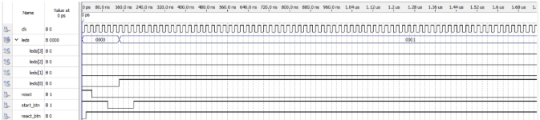<br>
</p>
<p align="center"><em>Fonte: Produzido no Quartus II.</em></p>

Durante o estado IDLE (0000) apertando o botão de Start (nível lógico: 1 → 0 → 1), inicia o estado WAITING (0001) e permanece até iniciar o estado GO (0100).

<p align="center">Figura 08 - Simulação Quartus II
</p>

<p align="center">
  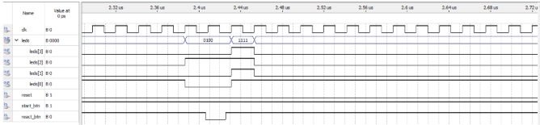<br>
</p>
<p align="center"><em>Fonte: Produzido no Quartus II.</em></p>

O LED de reação acende, estado GO (0100), o botão de Reação é apertado é o acerto acontece, estado SUCESS (1111).

<p align="center">Figura 09 - Simulação Quartus II
</p>

<p align="center">
  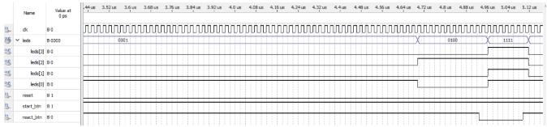<br>
</p>
<p align="center"><em>Fonte: Produzido no Quartus II.</em></p>

Após o acerto uma nova rodada inicia, voltando para o estado WAITING (0001), espera o estado GO (0100) acontecer e se acertar novamente o processo se repete.

<p align="center">Figura 10 - Simulação Quartus II
</p>

<p align="center">
  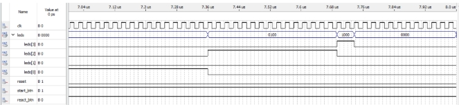<br>
</p>
<p align="center"><em>Fonte: Produzido no Quartus II.</em></p>

Nesta última parte da simulação, foi testado o erro. Não teve o acionamento do botão de Reação no momento certo, resultando no estado SHOW (1000) e em seguida, voltando para o estado IDLE (0000) novamente, sendo necessário que o botão de Start seja pressionado novamente para um novo jogo começar.

## 4. CONCLUSÃO E CONSIDERAÇÕES FINAIS

Através da realização deste projeto, do jogo de reflexo, foi possível pôr em prática a teoria de conceitos essenciais vistos em sala de aula e laboratório, como conceitos fundamentais da eletrônica digital, manipulações de entradas e saídas digitais e integração com elementos visuais da placa DE2. 

Após o estudo teórico e o preparo do hardware, aplicamos e testamos o funcionamento em tempo real em uma FPGA.

<p align="center">Figura 11 - Circuito setado Reset
</p>

<p align="center">
  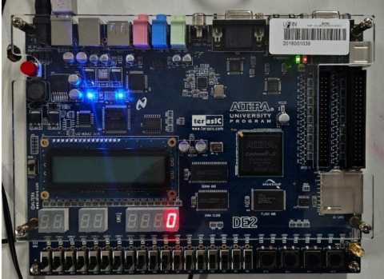<br>
</p>
<p align="center"><em>Fonte: Realizado em Laboratório.</em></p>

Essa primeira imagem representa o projeto no estado IDLE, aguardando a interação do usuário para que se inicie o jogo, no caso apertar o botão de start.

<p align="center">Figura 12 - Circuito setado Start
</p>

<p align="center">
  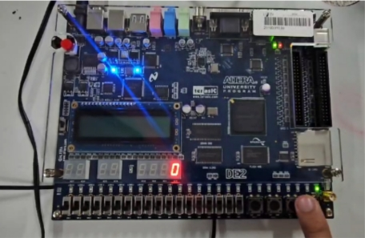<br>
</p>
<p align="center"><em>Fonte: Realizado em Laboratório.</em></p>

Após pressionar o botão Start, o jogo inicia o estado WAITING, nele o sistema sinaliza para o usuário esperar até que seja necessário reagir, acendendo o LEDG0.

<p align="center">Figura 13 - Jogador em ação, reagindo ao estímulo visual
</p>

<p align="center">
  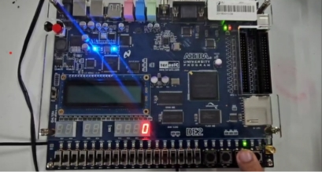<br>
</p>
<p align="center"><em>Fonte: Realizado em Laboratório.</em></p>

Assim que o LEDG0 apaga, o LEDG2 acende. Nesse momento o usuário deve apertar o botão de React para ser contabilizado o acerto e prosseguir para uma nova rodada.

<p align="center">Figura 14 - Acerto seguido de contabilização de pontuação
</p>

<p align="center">
  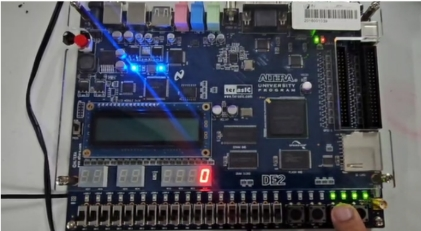<br>
</p>
<p align="center"><em>Fonte: Realizado em Laboratório.</em></p>

No momento que ocorre o acerto, todos os LEDs acendem, estado SUCESS, como indicação e é contabilizado 1 ponto no display de 7 segmentos assim que o botão de react para de ser pressionado.

<p align="center">Figura 15 - Inicialização de uma nova rodada
</p>

<p align="center">
  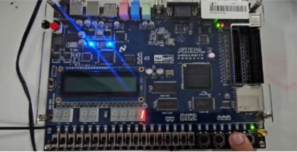<br>
</p>
<p align="center"><em>Fonte: Realizado em Laboratório.</em></p>

A partir desse momento é iniciado uma nova rodada, e vai permanecer nesse processo até que o usuário erre apertando o botão no momento errado ou não reagindo.

<p align="center">Figura 16 - Funcionamento
</p>

<p align="center">
  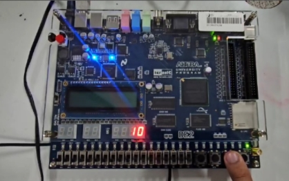<br>
</p>
<p align="center"><em>Fonte: Realizado em Laboratório.</em></p>

Esta imagem é apenas para mostrar que está sendo utilizado o HEX0 e HEX1 na contabilidade do placar. Com isso o usuário só consegue chegar até 99 pontos.


<p align="center">Figura 17 - Quando o usuário perde
</p>

<p align="center">
  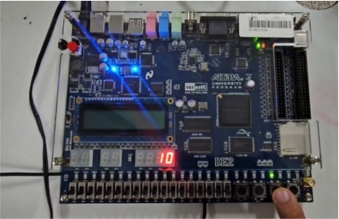<br>
</p>
<p align="center"><em>Fonte: Realizado em Laboratório.</em></p>

A imagem acima simula uma das formas de erro, o usuário pressiona o botão antes do LEDG2 acender, resultando no estado SHOW, o LEDG3 acende.

## 5. ANEXOS

<p align="center">
  <br>
</p>
